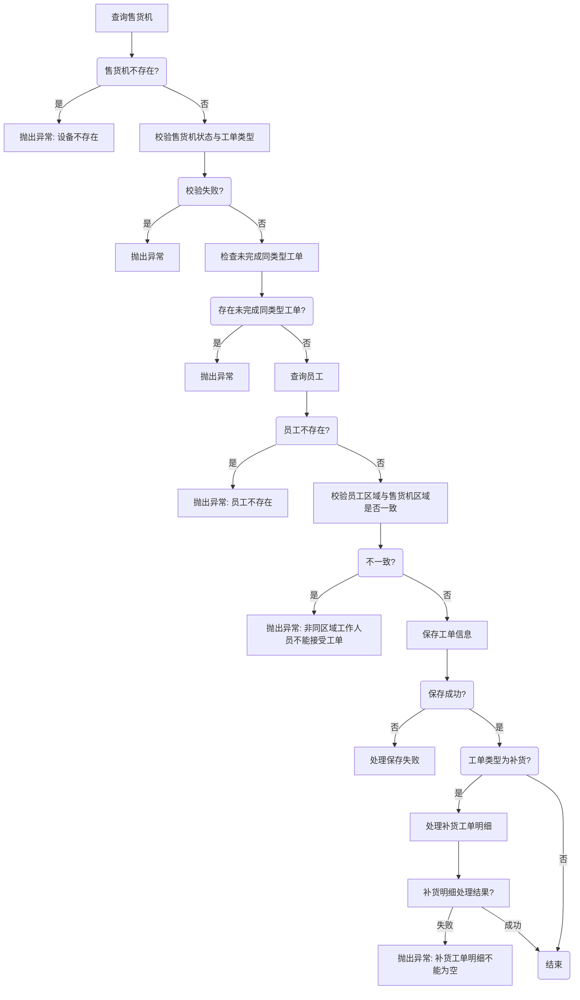

# AI大模型


## 提示工程

Prompt的组成

* 角色：给AI定义一个最匹配任务的角色，比如：「你是一位专业的博客作者」
* 指示：对任务进行描述，比如：「撰写一篇关于最新AI技术发展的文章」
* 上下文：给出与任务相关的其它背景信息
* 例子：必要时给出举例，[实践证明其对输出正确性有帮助]
* 输入：任务的输入信息；在提示词中明确的标识出输入
* 输出：输出的格式描述，以便后继模块自动解析模型的输出结果，比如（JSON、Java）

Prompt练习

* 角色：你是一位专业的博客作者。
* 指示：撰写一篇关于最新AI技术发展的文章。
* 上下文：文章应该涵盖AI技术的当前状态和未来趋势。
* 例子：可以引用最近的AI技术突破和行业专家的见解。
* 输入：当前AI技术的相关信息和数据。
* 输出：一篇结构清晰、观点鲜明的文章草稿。

**案例：**

```markdown
角色：你是一位专业的博客作者。

指示：撰写一篇关于最新AI技术发展的文章。

上下文：文章应该涵盖AI技术的当前状态和未来趋势。

例子：可以引用最近的AI技术突破和行业专家的见解。

输入：当前AI技术的相关信息和数据。

输出：一篇结构清晰、观点鲜明的文章草稿。
```


```markdown
角色：你是一位资深的Java开发工程师。

指示：编写一个Java函数，该函数接收两个整数参数，并返回它们的和。

上下文：这个函数将被用于一个简单的数学应用程序，该程序帮助学生练习基本的算术运算。

例子：如果你调用函数 `addNumbers(3, 5)`，它应该返回 `8`。

输入：两个整数参数，分别为 `int a` 和 `int b`。

输出：返回这两个整数的和，类型为 `int`。
```


### 常见的编程相关的Prompt

#### 表结构

```markdown
你是一个软件工程师，帮我生成MySQL的表结构
需求如下：
	1，课程管理表，表名tb_course，字段有主键id、课程编码、课程学科、课程名称、课程价格、适用人群、课程介绍
其他要求：
    1，每个表中都有创建时间(create_time)、修改时间(date_time)、创建人(create_by)、修改人(update_by)、备注(remark)这些字段
    2，每个表的主键都是自增的
    3，课程价格是整型、课程编码是字符串
    4，请为每个字段都添加上comment
    5，帮我给生成的表中插入一些IT课程示例数据
        课程学科：Java、人工智能、大数据
        适用人群：小白学员、中级程序员
```


#### 生成数据库说明文档

```markdown
你是一个软件工程师，现在要根据数据库的sql脚本，编写数据库说明文档，sql脚本如下：
CREATE TABLE `tb_course` (
    `id` INT AUTO_INCREMENT COMMENT '主键ID',
    `course_code` VARCHAR(255) NOT NULL COMMENT '课程编码',
    `course_subject` VARCHAR(100) NOT NULL COMMENT '课程学科',
    `course_name` VARCHAR(255) NOT NULL COMMENT '课程名称',
    `course_price` INT COMMENT '课程价格',
    `target_audience` VARCHAR(100) COMMENT '适用人群',
    `course_introduction` TEXT COMMENT '课程介绍',
    `create_time` DATETIME COMMENT '创建时间',
    `update_time` DATETIME COMMENT '修改时间',
    `create_by` VARCHAR(64) COMMENT '创建人',
    `update_by` VARCHAR(64) COMMENT '修改人',
    `remark` VARCHAR(255) COMMENT '备注',
    PRIMARY KEY (`id`)
) ENGINE=InnoDB DEFAULT CHARSET=utf8mb4 COMMENT='课程管理表';

输出要求是：
	1，每个表以及每个表的字段都要详细说明，包括，字段名称、类型、作用
	2，使用markdown的输出格式，字段的描述需要使用表格展示
	3，如果表之间有关系，需要描述清楚表之间的关系
```

#### 生成代码

代码生成算是比较常规的方案，用的也比较多，分为了几种情况

- 给出表生成代码（项目中常见）
  - 给出表结构的ddl，可以输出这个表的增删改查的所有代码
  - 给出表结构的dll，可以输出增删改查的接口文档
- 补全代码
  - 例1-给出实体类，帮助编写getter、setter、toString、构造方法等等
  - 例2-给出一个controller，帮助编写swagger注解等
- 提取结构（无含金量，费时间的编程）
  - 例1-根据接口文档提取dto类或者vo类

#### 生成代码流程图

有一些比较复杂的业务流程，往往需要画出流程图，现在就可以使用ai协助我们画流程图

```java
你是一个软件工程师，为了方便理解代码执行流程，需要给出代码执行的流程图，代码如下：
    // 创建工单
    @Transactional
    @Override
    public int insertTaskDto(TaskDto taskDto) {
    //1. 查询售货机是否存在
    VendingMachine vm = vendingMachineService.selectVendingMachineByInnerCode(taskDto.getInnerCode());
    if (vm == null) {
        throw new ServiceException("设备不存在");
    }
    //2. 校验售货机状态与工单类型是否相符
    checkCreateTask(vm.getVmStatus(), taskDto.getProductTypeId());
    //3. 校验这台设备是否有未完成的同类型工单，如果存在则不能创建
    hasTask(taskDto.getInnerCode(), taskDto.getProductTypeId());
    //4. 校验员工是否存在
    Emp emp = empService.selectEmpById(taskDto.getUserId());
    if (emp == null) {
        throw new ServiceException("员工不存在");
    }
    // 5. 校验非同区域下的工作人员不能接受工单
    if (emp.getRegionId() != vm.getRegionId()) {
        throw new ServiceException("非同区域下的工作人员不能接受工单");
    }
    //6. 保存工单信息
    Task task = new Task();
    BeanUtil.copyProperties(taskDto, task);// 属性赋值
    task.setCreateTime(DateUtils.getNowDate());// 创建时间
    task.setTaskCode(generateTaskCode());// 工单编号 202405150001
    task.setTaskStatus(DkdContants.TASK_STATUS_CREATE);// 创建工单
    task.setAddr(vm.getAddr());
    task.setRegionId(vm.getRegionId());
    task.setUserName(emp.getUserName());
    int taskResult = taskMapper.insertTask(task);
    //7. 如果是补货工单，向工单明细表插入记录
    if (task.getProductTypeId() == DkdContants.TASK_TYPE_SUPPLY) {
        if (CollUtil.isEmpty(taskDto.getDetails())) {
            throw new ServiceException("补货工单明细不能为空");
        }
        List<TaskDetails> taskDetailsList = taskDto.getDetails().stream().map(details -> {
            TaskDetails taskDetails = BeanUtil.copyProperties(details, TaskDetails.class);
            taskDetails.setTaskId(task.getTaskId());
            return taskDetails;
        }).collect(Collectors.toList());
        taskDetailsService.insertBatch(taskDetailsList);
    }

    return taskResult;
}

输出：请使用mermaid语言来描述这个方法的流程
```




